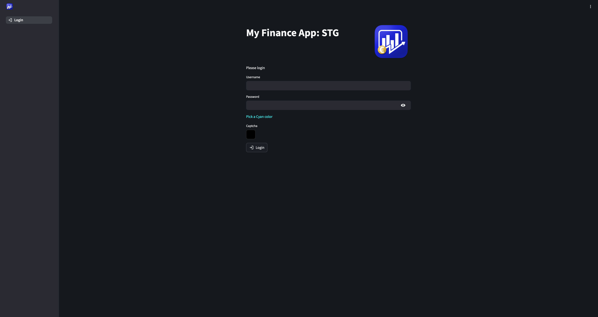
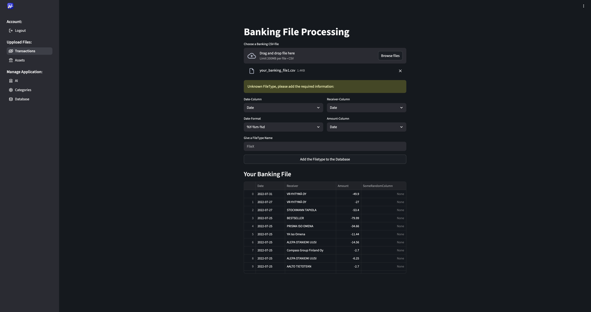
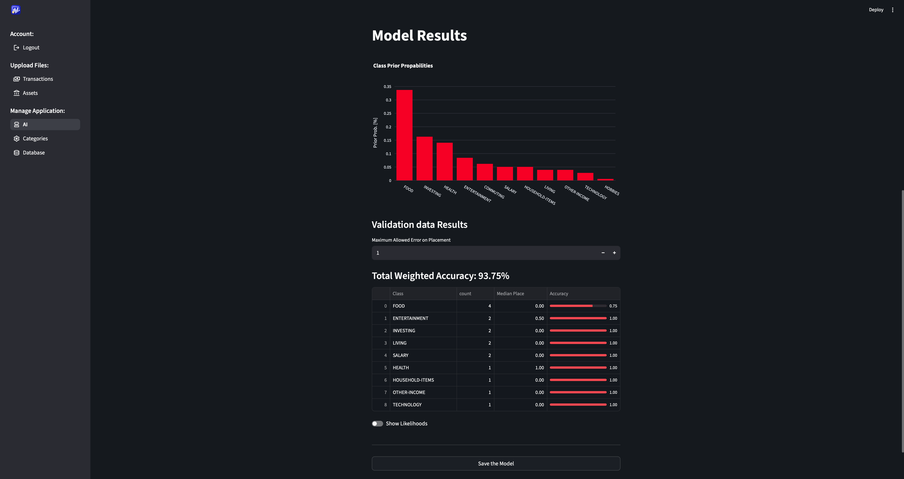
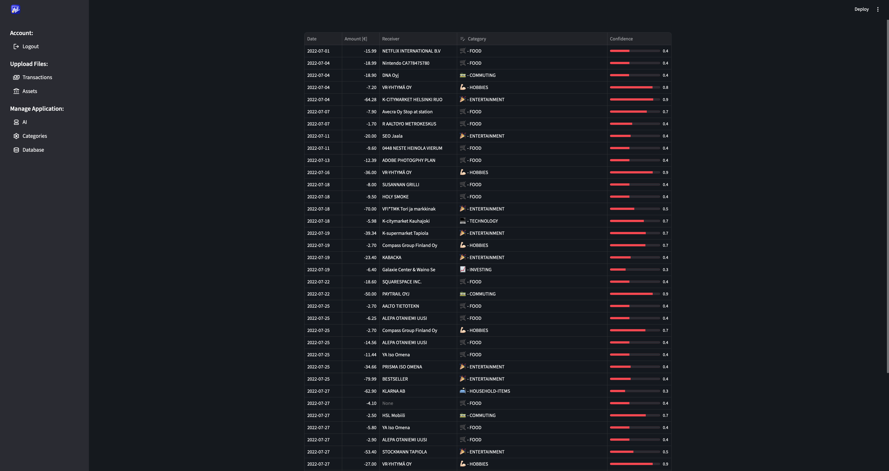
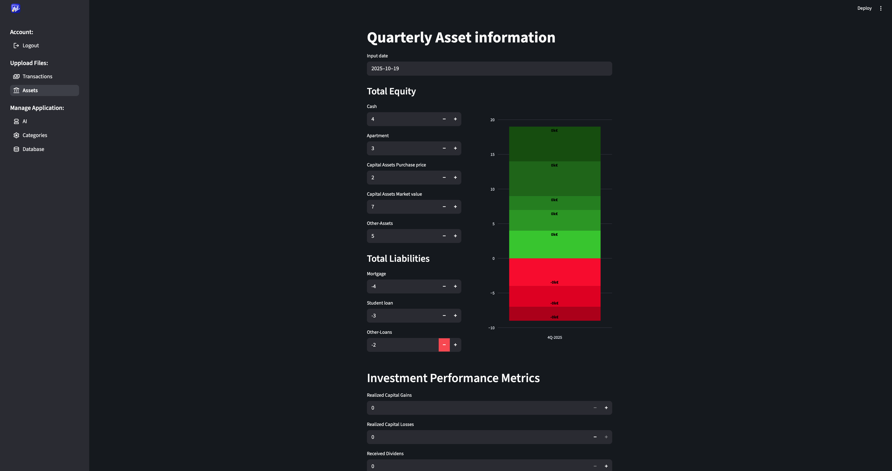

# My Finance - Streamlit application

[](https://rasmushaa.github.io/my_finance_st/)

## 📑 Table of Contents
- [Overview](#overview)
- [Feature Demos](#feature-demos)
- [Project Setup](#project-setup)
  - [1. Install dependencies](#1-install-dependencies)
  - [2. Initialize BigQuery tables](#2-initialize-bigquery-tables)
  - [3. .env-file](#3-env-file)
- [Running the Application](#running-the-application)
  - [Local Streamlit](#local-streamlit)
  - [Local Docker Container](#local-docker-container)
- [Development & Deployment Workflow](#development--deployment-workflow)
- [Appendix](#appendix)
  - [Troubleshooting](#troubleshooting)

---

## Overview
The **My Finance** Streamlit application helps you automatically **label your banking transaction files** and store the data in **Google BigQuery**.  
You can also include and manage **asset information**, and modify existing data directly through the interface.  

The application supports **multiple users with different roles** (e.g., *admin* and *user*).  
**Access requires valid credentials**, which are stored securely on the database.

---

### Feature Demos
Login             |  Banking file type detection | ML Model training
:-------------------------:|:-------------------------:|:--------------:
  |   | 

Transaction labeling             |  Asset monitoring | Cloud data deletion
:-------------------------:|:-------------------------:|:--------------:
  |   | 

---

## Project Setup

### 1. Install dependencies
Install [`pip-tools`](https://github.com/jazzband/pip-tools) and compile your requirements:
```bash
pip install pip-tools
pip-compile requirements.in
```
Then create and activate your local virtual environment as usual.

### 2. Initialize BigQuery tables
Run:
```
python3 init_bigquery_database.py <environment_name>   # e.g. dev, stg, prod
```
This will create all required BigQuery tables with the correct schema and structure.

### 3. `.env` file
The project expects a `.env` file in the project root directory for local development.  
This file is used to configure Streamlit and Docker for local testing.  
For deployed environments, these variables are stored as GitHub Actions secrets and are passed to the Google Cloud Run runtime automatically.  
Example `.env` file:
```
GCP_PROJECT_ID=my-awesome-project   # Your Google Cloud project ID
GCP_LOCATION=europe-west            # The supported location of your GCP project
GCP_BQ_DATASET=my-dataset           # BigQuery dataset where all tables are stored
GCP_CGS_BUCKET=my-application       # Name of your GCS bucket
GCP_CGS_BUCKET_DIR=app_bucket       # Path within the bucket
STREAMLIT_ENV=dev                   # Environment suffix for files, tables, and models
```


## Running the Application
### Local Streamlit
Use the helper script:
```
./run_dev_streamlit.sh
```
This script:
- Kills any previously running Streamlit instances
- Loads the local .env configuration
- Launches the development server
You can then develop the app like a regular Streamlit project.


### Local Docker Container
Use the helper script:
```
./run_dev_docker.sh
```
This script:
- Builds the latest image of your code
- Starts the Docker daemon
- Stops any previous container
- Launches a new container with the latest build
The container mounts your local GCP auth config:
```
$HOME/.config/gcloud:/root/.config/gcloud
```
This is where your gcloud auth and gcloud auth application-default credentials are stored,  
allowing the container to authenticate to Google Cloud without browser-based login.  
> 💡 If authentication fails, refresh your credentials manually before starting the container.

- Use `run_dev_docker.sh` to 
    - build the *latest* image of your code  
    - automatically launch Docker dameon 
    - kill previous containers  
    - to deploy the latest image to a new container.  
- The container will have access to `$HOME/.config/gcloud:/root/.config/gcloud` local dir  
which is the default place to store your `gcloud auth` and `gcloud auth application-default` credentials.  
    - This allows the code to auhtenticate to Google Cloud inside of the container.  
- You should refresh you credentials manaully beofore running container, if you face auth porblems.


## Development & Deployment Workflow
- Use the `dev branch` to test changes locally.
- Open a Pull Request (PR) from `dev` → `stg`
    - This triggers the CI/CD pipeline to **build** and **deploy** a new image to **Cloud Run** (staging).
    - Validate the app in the staging environment.
- Open a PR from `st`g` → `prod`
    - This triggers the CI/CD pipeline to deploy to the production environment.


## Appendix

### Troubleshooting

#### OAuth does not work locally
##### Refresh credentials:
```
gcloud auth login
gcloud auth application-default login
```
##### Manually remove the ADC file if needed:
```
rm -f ~/.config/gcloud/application_default_credentials.json
```
##### Update the `gcloud` CLI to the latest version.
##### Pandas vs BigQuery Client auth
- `pandas_gbq` uses **CLI credentials**
- `bigquery.Client()` uses **Application Default Credentials (ADC)**.  
    → Make sure **both tokens** are valid.
##### Docker authentication
- Docker cannot open a browser for OAuth.
- Mount your ADC file into the container:
``` 
~/.config/gcloud/application_default_credentials.json
```
- Ensure the path is correct and the file is valid on your system.
##### Cloud Run vs local auth
- Locally → uses your **personal credentials**
- Cloud Run → uses the service account attached to the container:
    - No OAuth prompt is required; ADC works automatically in the container environment.        
- If you encounter issues locally but not on staging, the problem is likely related to your local credentials, not the code itself.

